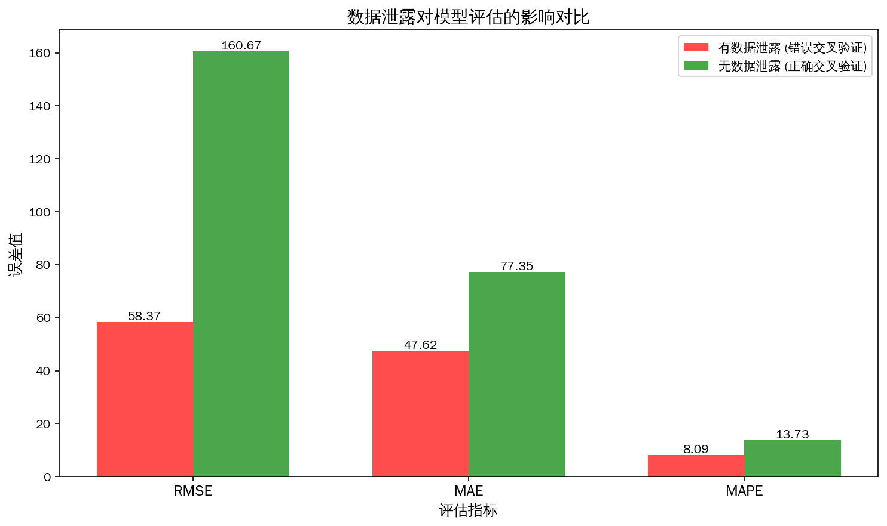

# Milestone 2: 数据泄露分析与防泄露流水线

## 实验目的

演示数据泄露的危害，以及如何构建无泄露的交叉验证流水线。

## 实验设计

| 实验 | 预处理方式 | 说明 |
|------|-----------|------|
| 错误交叉验证 | 全局预处理（标准化 + 缺失值填补） | 验证集信息泄露 |
| 正确交叉验证 | 循环内预处理（只用训练集拟合） | 无数据泄露 |

## 结果对比

| 指标 | 有数据泄露 (错误交叉验证) | 无数据泄露 (正确交叉验证) | 差异 |
|------|-------------------------|-------------------------|------|
| RMSE | 58.3710 | 160.6685 | -102.2975 |
| MAE | 47.6152 | 77.3546 | -29.7394 |
| MAPE | 8.09% | 13.73% | -5.64% |

## 结论

### 为什么泄露版的指标更'好看'？

泄露版在预处理阶段使用了全量数据（包括验证集）的统计量：
1. 标准化时用了验证集的均值和标准差
2. 缺失值填补用了验证集的均值

这导致验证集信息被偷看，模型评估结果虚高，无法反映真实的泛化能力。

### 为什么老板应该看真实的泛化误差？

泄露版的好成绩是假的，模型上线后在新数据上表现会大幅下降。
无泄露版的成绩才是模型真实的泛化误差，能准确预测未来的业务表现。

### 业务解读

模型上线后，每天的销售额预测平均绝对百分比误差约为 **13.73%**。
这意味着如果某天实际销售额为 100 万元，我们的预测误差大约在 ±13.73 万元左右。

## 可视化

