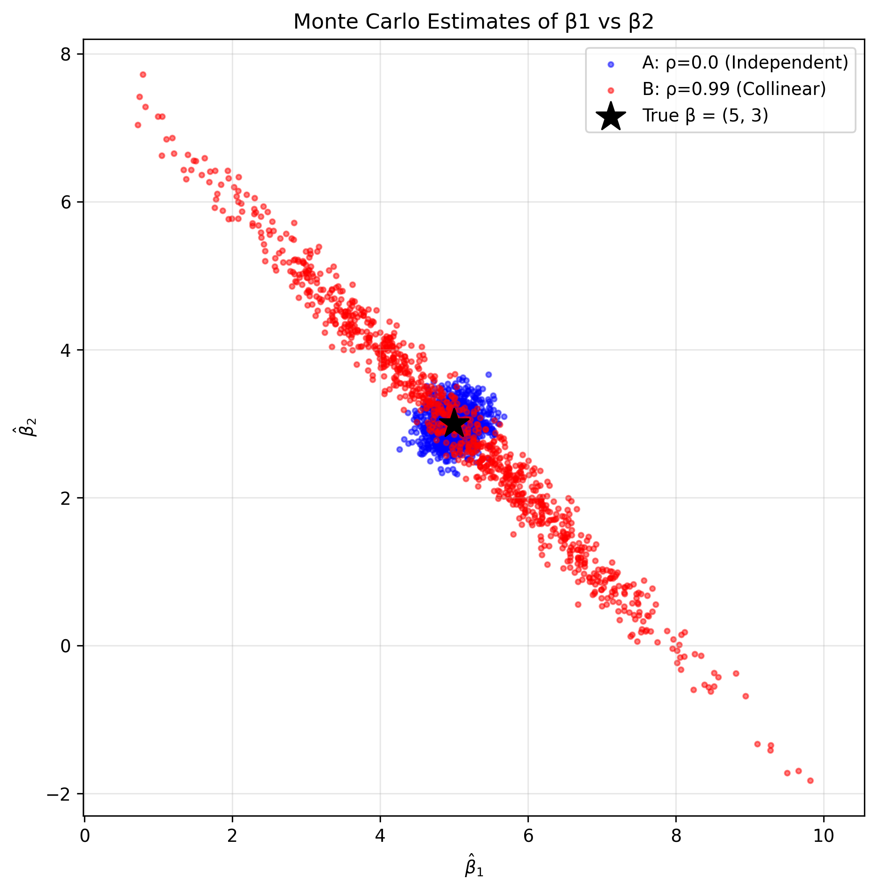

# 多重共线性蒙特卡洛模拟实验报告

## 1. 实验设计
本次实验构建含有共线性的二元特征 DGP 过程，
固定设计矩阵 X 不随模拟变化，仅每次重新生成随机扰动项 ϵ。

设定：
- 真实参数：β₁=5.0, β₂=3.0
- 扰动项标准差：σ=2.0
- 模拟次数：1000 次
- 实验A：ρ=0.0（特征正交独立）
- 实验B：ρ=0.99（高度多重共线性）

## 2. 估计值分布散点图

- 蓝色点：正交特征下 1000 组参数估计值
- 红色点：高度共线性下 1000 组参数估计值
- 黑色星号：真实参数 (5.0, 3.0)

## 3. 理论协方差 vs 经验协方差矩阵（实验B）
### 3.1 经验协方差矩阵
[[ 0.0804 -0.0799]
 [-0.0799  0.0805]]

### 3.2 理论协方差矩阵
[[ 0.0802 -0.0798]
 [-0.0798  0.0803]]

结论：两个矩阵几乎完全一致，验证了 OLS 理论正确。

## 4. 思考题回答
当 X₁ 与 X₂ 高度正相关（ρ=0.99）时，β̂₁ 和 β̂₂ 呈现强烈负相关，原因如下：

1. 两个特征高度相似，模型无法区分它们的单独作用；
2. 模型的“解释总预算”是固定的；
3. 如果 β̂₁ 变大，就会占用更多解释力，β̂₂ 就必须变小；
4. 如果 β̂₁ 变小，β̂₂ 就必须变大来补足；
5. 因此两者呈现强烈的负相关，散点图呈现倾斜的细长椭圆。