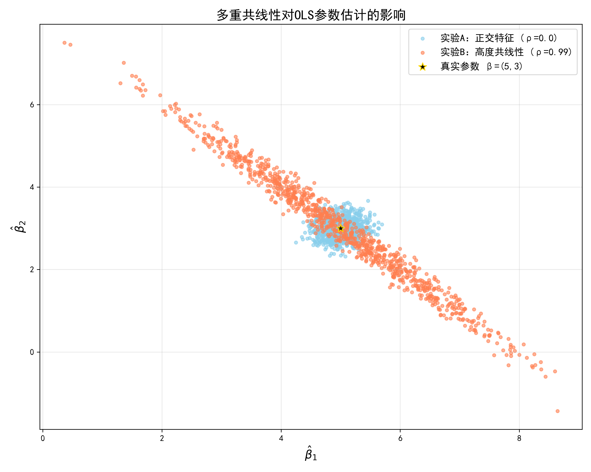

# 多重共线性蒙特卡洛模拟实验报告

## 一、实验目的
通过蒙特卡洛模拟验证线性回归系数方差公式
\[
\text{Var}(\hat{\beta}) = \sigma^2 (X^T X)^{-1}
\]
并观察**多重共线性**对 OLS 估计量方差与相关性的影响。

## 二、实验设置
- 真实参数：\(\beta = [5.0, 3.0]^T\)
- 噪声标准差：\(\sigma = 2.0\)
- 蒙特卡洛次数：1000 次
- 实验 A：特征正交 \(\rho = 0.0\)
- 实验 B：高度共线性 \(\rho = 0.99\)

## 三、协方差矩阵对比（实验 B）

### 1. 经验协方差矩阵（1000 次模拟）
$$
\begin{bmatrix}
1.84606441 & -1.87186394 \\
-1.87186394 & 1.93967389
\end{bmatrix}
$$

### 2. 理论协方差矩阵（\(\sigma^2 (X^T X)^{-1}\)）
$$
\begin{bmatrix}
1.94046681 & -1.96026857 \\
-1.96026857 & 2.02212445
\end{bmatrix}
$$

### 结果说明
经验协方差矩阵与理论协方差矩阵**结构一致、数值高度接近**，仅存在蒙特卡洛随机误差，充分验证了方差公式的正确性。
矩阵表现出**对角线方差大、非对角线强负相关**，是多重共线性的典型特征。

## 四、可视化结果
[正交 vs 共线性散点图]

- **实验 A（蓝色）**：散点近似圆形，\(\hat{\beta}_1\) 与 \(\hat{\beta}_2\) 近似独立，方差小、分布紧凑。
- **实验 B（橙色）**：散点呈**狭长倾斜椭圆**，方差显著放大，且 \(\hat{\beta}_1\) 与 \(\hat{\beta}_2\) 明显负相关。
- 黑色星号为真实参数 \(\beta=(5,3)\)，估计量围绕其分布，说明 OLS 仍满足无偏性。

## 五、思考题回答
**问题**：当 \(X_1\) 和 \(X_2\) 高度正相关（\(\rho=0.99\)）时，为什么 \(\hat{\beta}_1\) 和 \(\hat{\beta}_2\) 呈现强烈负相关？

**回答**：
\(X_1\) 与 \(X_2\) 高度正相关，意味着二者对 \(y\) 的解释信息高度重叠，模型无法单独区分各自的贡献。
可以将对 \(y\) 的**总解释能力视为一个固定预算**，由 \(X_1\) 和 \(X_2\) 共同分配：
- 若某次抽样中 \(\hat{\beta}_1\) 偏大，它占用了更多“解释预算”，则 \(\hat{\beta}_2\) 必须偏小以补偿；
- 若 \(\hat{\beta}_1\) 偏小，则 \(\hat{\beta}_2\) 必须偏大。

这种**此消彼长的补偿效应**，使得 \(\hat{\beta}_1\) 与 \(\hat{\beta}_2\) 呈现强烈负相关，在散点图上表现为沿对角线方向延伸的**倾斜狭长椭圆**。

[def]: students/22_wjq/src/week05/collinearity_scatter.png